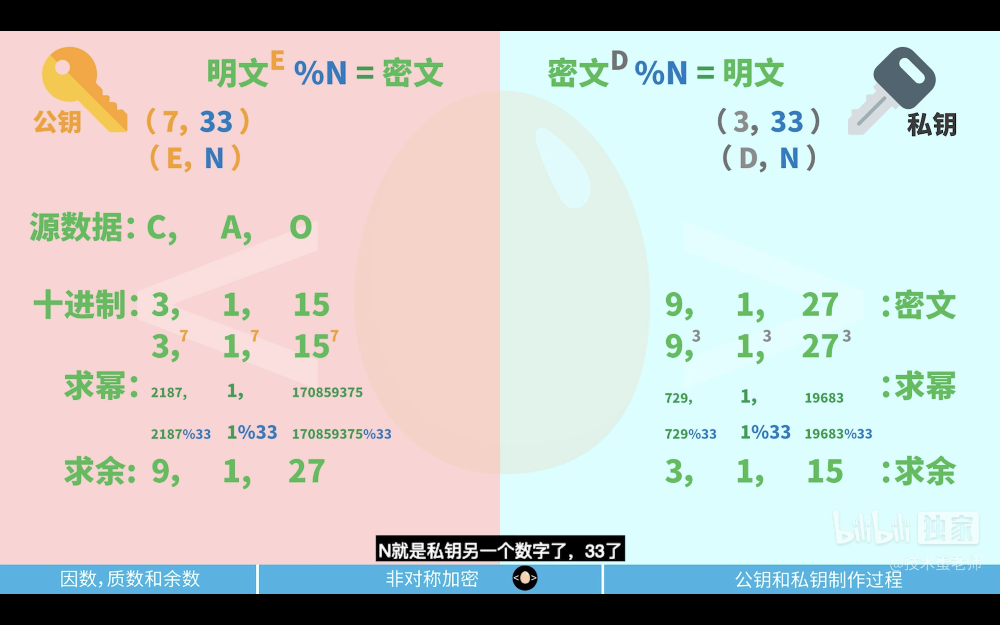

# RSA 算法

RSA算法是一种广泛使用的非对称加密算法，它依赖于大整数分解的困难性。RSA的名字来自于它的三个发明者Ron Rivest、Adi Shamir和Leonard Adleman，他们在1977年首次公布了这个算法。

RSA算法的基本过程包括密钥生成、加密和解密三个步骤：

## 原理

### 数学模型
利用极大的数难以做因数分解规律做加密方案
极大数为两个极大的质数的积

### 密钥生成
a. 选择两个大的质数 ( p ) 和 ( q )，并且这两个质数的数值应该相差不会太近，以增加破解难度。
b. 计算 ( p ) 和 ( q ) 的乘积 ( n = pq )，( n ) 的位数决定了密钥的大小。( n ) 用于公钥和私钥，它的长度，即比特数，通常是加密强度的一个直接标志（如1024位、2048位）。
c. 计算 ( n ) 的欧拉函数 ( \phi(n) = (p-1)(q-1) )。
d. 选择一个整数 ( e )，使得 ( e ) 与 ( \phi(n) ) 互质，并且 ( e ) 通常比较小，通常选用65537（因为它是一个质数且形式上只有两个二进制位是1，其他都是0，这使得计算更快）。
e. 计算 ( e ) 相对于 ( \phi(n) ) 的模逆元 ( d )，即 ( ed \equiv 1 \mod \phi(n) )。这里 ( d ) 用于私钥。
f. 公钥由 ( (e, n) ) 组成，私钥由 ( (d, n) ) 组成。

## 加密
要加密信息，首先将信息转换为一个大整数 ( M )，使得 ( M ) 的数值小于 ( n ) 的数值（需要使用填充方案如PKCS#1）。然后使用接收方的公钥 ( (e, n) ) 计算加密后的消息 ( C )，即 ( C = M^e \mod n )。

## 解密
接收方已知私钥 ( (d, n) ) 能够解密消息 ( C ) 获取原始消息 ( M )，即 ( M = C^d \mod n )。

RSA算法的安全性基于大整数的质因数分解是非常困难的，特别是当选取的质数很大的时候。到目前为止，没有已知的多项式时间算法能够分解非常大的整数。尽管如此，随着量子计算的发展，RSA的安全性在未来可能会遭遇挑战，因为量子计算机使用Shor算法可以在多项式时间内分解大整数。

## 填充方式
+ 传输的数据包
    + 公钥
    + 2048位构成的质数的积
    + 加密数据
    + 填充类型
    + 填充数据

